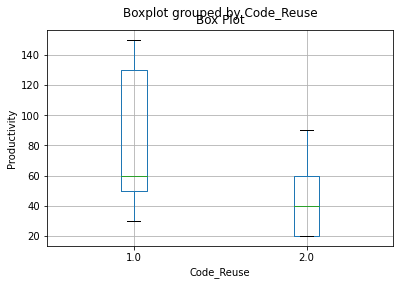
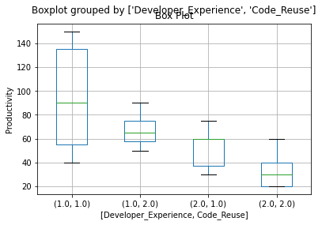

```python
import pandas as pd
from matplotlib import pyplot as plt
```


```python
# a. Import the file to Python 
mydata = pd.read_excel("Z:\Machine Learning\College ML subject\Descriptive Statistics\Productivity.xlsx")
mydata
```


<div>
<style scoped>
    .dataframe tbody tr th:only-of-type {
        vertical-align: middle;
    }

    .dataframe tbody tr th {
        vertical-align: top;
    }

    .dataframe thead th {
        text-align: right;
    }
</style>
<table border="1" class="dataframe">
  <thead>
    <tr style="text-align: right;">
      <th></th>
      <th>SL No.</th>
      <th>Developer_Experience</th>
      <th>Code_Reuse</th>
      <th>Knowledge_Repository_Usage</th>
      <th>Productivity</th>
    </tr>
  </thead>
  <tbody>
    <tr>
      <th>0</th>
      <td>1.0</td>
      <td>1.0</td>
      <td>1.0</td>
      <td>1.0</td>
      <td>140.0</td>
    </tr>
    <tr>
      <th>1</th>
      <td>2.0</td>
      <td>2.0</td>
      <td>2.0</td>
      <td>2.0</td>
      <td>20.0</td>
    </tr>
    <tr>
      <th>2</th>
      <td>3.0</td>
      <td>2.0</td>
      <td>1.0</td>
      <td>2.0</td>
      <td>30.0</td>
    </tr>
    <tr>
      <th>3</th>
      <td>4.0</td>
      <td>2.0</td>
      <td>1.0</td>
      <td>2.0</td>
      <td>30.0</td>
    </tr>
    <tr>
      <th>4</th>
      <td>5.0</td>
      <td>1.0</td>
      <td>1.0</td>
      <td>1.0</td>
      <td>130.0</td>
    </tr>
    <tr>
      <th>5</th>
      <td>6.0</td>
      <td>2.0</td>
      <td>1.0</td>
      <td>2.0</td>
      <td>60.0</td>
    </tr>
    <tr>
      <th>6</th>
      <td>7.0</td>
      <td>2.0</td>
      <td>2.0</td>
      <td>2.0</td>
      <td>20.0</td>
    </tr>
    <tr>
      <th>7</th>
      <td>8.0</td>
      <td>2.0</td>
      <td>2.0</td>
      <td>2.0</td>
      <td>60.0</td>
    </tr>
    <tr>
      <th>8</th>
      <td>9.0</td>
      <td>2.0</td>
      <td>1.0</td>
      <td>2.0</td>
      <td>60.0</td>
    </tr>
    <tr>
      <th>9</th>
      <td>10.0</td>
      <td>1.0</td>
      <td>1.0</td>
      <td>2.0</td>
      <td>90.0</td>
    </tr>
    <tr>
      <th>10</th>
      <td>11.0</td>
      <td>2.0</td>
      <td>2.0</td>
      <td>2.0</td>
      <td>30.0</td>
    </tr>
    <tr>
      <th>11</th>
      <td>12.0</td>
      <td>2.0</td>
      <td>2.0</td>
      <td>2.0</td>
      <td>40.0</td>
    </tr>
    <tr>
      <th>12</th>
      <td>13.0</td>
      <td>1.0</td>
      <td>2.0</td>
      <td>1.0</td>
      <td>90.0</td>
    </tr>
    <tr>
      <th>13</th>
      <td>14.0</td>
      <td>1.0</td>
      <td>2.0</td>
      <td>2.0</td>
      <td>50.0</td>
    </tr>
    <tr>
      <th>14</th>
      <td>15.0</td>
      <td>1.0</td>
      <td>1.0</td>
      <td>2.0</td>
      <td>50.0</td>
    </tr>
    <tr>
      <th>15</th>
      <td>16.0</td>
      <td>2.0</td>
      <td>2.0</td>
      <td>2.0</td>
      <td>30.0</td>
    </tr>
    <tr>
      <th>16</th>
      <td>17.0</td>
      <td>1.0</td>
      <td>1.0</td>
      <td>1.0</td>
      <td>90.0</td>
    </tr>
    <tr>
      <th>17</th>
      <td>18.0</td>
      <td>1.0</td>
      <td>1.0</td>
      <td>2.0</td>
      <td>40.0</td>
    </tr>
    <tr>
      <th>18</th>
      <td>19.0</td>
      <td>1.0</td>
      <td>1.0</td>
      <td>1.0</td>
      <td>140.0</td>
    </tr>
    <tr>
      <th>19</th>
      <td>20.0</td>
      <td>2.0</td>
      <td>2.0</td>
      <td>2.0</td>
      <td>60.0</td>
    </tr>
    <tr>
      <th>20</th>
      <td>21.0</td>
      <td>1.0</td>
      <td>2.0</td>
      <td>2.0</td>
      <td>60.0</td>
    </tr>
    <tr>
      <th>21</th>
      <td>22.0</td>
      <td>1.0</td>
      <td>2.0</td>
      <td>1.0</td>
      <td>70.0</td>
    </tr>
    <tr>
      <th>22</th>
      <td>23.0</td>
      <td>2.0</td>
      <td>2.0</td>
      <td>2.0</td>
      <td>20.0</td>
    </tr>
    <tr>
      <th>23</th>
      <td>24.0</td>
      <td>1.0</td>
      <td>1.0</td>
      <td>1.0</td>
      <td>150.0</td>
    </tr>
    <tr>
      <th>24</th>
      <td>25.0</td>
      <td>2.0</td>
      <td>1.0</td>
      <td>2.0</td>
      <td>60.0</td>
    </tr>
    <tr>
      <th>25</th>
      <td>26.0</td>
      <td>1.0</td>
      <td>1.0</td>
      <td>1.0</td>
      <td>130.0</td>
    </tr>
    <tr>
      <th>26</th>
      <td>27.0</td>
      <td>2.0</td>
      <td>1.0</td>
      <td>1.0</td>
      <td>75.0</td>
    </tr>
    <tr>
      <th>27</th>
      <td>28.0</td>
      <td>2.0</td>
      <td>2.0</td>
      <td>2.0</td>
      <td>20.0</td>
    </tr>
    <tr>
      <th>28</th>
      <td>29.0</td>
      <td>1.0</td>
      <td>1.0</td>
      <td>2.0</td>
      <td>40.0</td>
    </tr>
    <tr>
      <th>29</th>
      <td>30.0</td>
      <td>1.0</td>
      <td>1.0</td>
      <td>2.0</td>
      <td>60.0</td>
    </tr>
  </tbody>
</table>
</div>


```python
# b. Compute descriptive summary of variable Productivity
prod = mydata["Productivity"]
```


```python
prod.mean()
```


    64.83333333333333


```python
prod.median()
```


    60.0


```python
prod.mode()
```


    0    60.0
    dtype: float64


```python
prod.max()
```


    150.0


```python
prod.describe()
```


    count     30.000000
    mean      64.833333
    std       39.139083
    min       20.000000
    25%       32.500000
    50%       60.000000
    75%       86.250000
    max      150.000000
    Name: Productivity, dtype: float64


```python
# c. Check whether the average productivity varies with developer experience?
prod.groupby(mydata["Developer_Experience"]).describe()
```


<div>
<style scoped>
    .dataframe tbody tr th:only-of-type {
        vertical-align: middle;
    }

    .dataframe tbody tr th {
        vertical-align: top;
    }

    .dataframe thead th {
        text-align: right;
    }
</style>
<table border="1" class="dataframe">
  <thead>
    <tr style="text-align: right;">
      <th></th>
      <th>count</th>
      <th>mean</th>
      <th>std</th>
      <th>min</th>
      <th>25%</th>
      <th>50%</th>
      <th>75%</th>
      <th>max</th>
    </tr>
    <tr>
      <th>Developer_Experience</th>
      <th></th>
      <th></th>
      <th></th>
      <th></th>
      <th></th>
      <th></th>
      <th></th>
      <th></th>
    </tr>
  </thead>
  <tbody>
    <tr>
      <th>1.0</th>
      <td>15.0</td>
      <td>88.666667</td>
      <td>39.797104</td>
      <td>40.0</td>
      <td>55.0</td>
      <td>90.0</td>
      <td>130.0</td>
      <td>150.0</td>
    </tr>
    <tr>
      <th>2.0</th>
      <td>15.0</td>
      <td>41.000000</td>
      <td>19.291005</td>
      <td>20.0</td>
      <td>25.0</td>
      <td>30.0</td>
      <td>60.0</td>
      <td>75.0</td>
    </tr>
  </tbody>
</table>
</div>


```python
mydata.boxplot(column='Productivity', by='Developer_Experience')
plt.title('Box Plot')
plt.ylabel('Productivity')
plt.show()
```


    

    


```python
#d. Check whether the average productivity varies with code reuse? 
prod.groupby(mydata['Code_Reuse']).describe()
```


<div>
<style scoped>
    .dataframe tbody tr th:only-of-type {
        vertical-align: middle;
    }

    .dataframe tbody tr th {
        vertical-align: top;
    }

    .dataframe thead th {
        text-align: right;
    }
</style>
<table border="1" class="dataframe">
  <thead>
    <tr style="text-align: right;">
      <th></th>
      <th>count</th>
      <th>mean</th>
      <th>std</th>
      <th>min</th>
      <th>25%</th>
      <th>50%</th>
      <th>75%</th>
      <th>max</th>
    </tr>
    <tr>
      <th>Code_Reuse</th>
      <th></th>
      <th></th>
      <th></th>
      <th></th>
      <th></th>
      <th></th>
      <th></th>
      <th></th>
    </tr>
  </thead>
  <tbody>
    <tr>
      <th>1.0</th>
      <td>17.0</td>
      <td>80.882353</td>
      <td>41.841789</td>
      <td>30.0</td>
      <td>50.0</td>
      <td>60.0</td>
      <td>130.0</td>
      <td>150.0</td>
    </tr>
    <tr>
      <th>2.0</th>
      <td>13.0</td>
      <td>43.846154</td>
      <td>22.926863</td>
      <td>20.0</td>
      <td>20.0</td>
      <td>40.0</td>
      <td>60.0</td>
      <td>90.0</td>
    </tr>
  </tbody>
</table>
</div>


```python
mydata.boxplot(column='Productivity', by='Code_Reuse')
plt.ylabel('Productivity')
plt.title('Box Plot')
plt.show()
```


    

    


```python
# e. Check whether the average productivity varies with knowledge repository usage?
prod.groupby(mydata.Knowledge_Repository_Usage).describe()
```


<div>
<style scoped>
    .dataframe tbody tr th:only-of-type {
        vertical-align: middle;
    }

    .dataframe tbody tr th {
        vertical-align: top;
    }

    .dataframe thead th {
        text-align: right;
    }
</style>
<table border="1" class="dataframe">
  <thead>
    <tr style="text-align: right;">
      <th></th>
      <th>count</th>
      <th>mean</th>
      <th>std</th>
      <th>min</th>
      <th>25%</th>
      <th>50%</th>
      <th>75%</th>
      <th>max</th>
    </tr>
    <tr>
      <th>Knowledge_Repository_Usage</th>
      <th></th>
      <th></th>
      <th></th>
      <th></th>
      <th></th>
      <th></th>
      <th></th>
      <th></th>
    </tr>
  </thead>
  <tbody>
    <tr>
      <th>1.0</th>
      <td>9.0</td>
      <td>112.777778</td>
      <td>31.135903</td>
      <td>70.0</td>
      <td>90.0</td>
      <td>130.0</td>
      <td>140.0</td>
      <td>150.0</td>
    </tr>
    <tr>
      <th>2.0</th>
      <td>21.0</td>
      <td>44.285714</td>
      <td>18.860389</td>
      <td>20.0</td>
      <td>30.0</td>
      <td>40.0</td>
      <td>60.0</td>
      <td>90.0</td>
    </tr>
  </tbody>
</table>
</div>


```python
mydata.boxplot(column='Productivity', by='Knowledge_Repository_Usage')
plt.title('Box Plot')
plt.ylabel('Productivity')
plt.show()
```


    

    


```python
# f.Compute the aggregate average of productivity with developer experience & code reuse?
prod.groupby([mydata.Developer_Experience, mydata.Code_Reuse]).describe()
```


<div>
<style scoped>
    .dataframe tbody tr th:only-of-type {
        vertical-align: middle;
    }

    .dataframe tbody tr th {
        vertical-align: top;
    }

    .dataframe thead th {
        text-align: right;
    }
</style>
<table border="1" class="dataframe">
  <thead>
    <tr style="text-align: right;">
      <th></th>
      <th></th>
      <th>count</th>
      <th>mean</th>
      <th>std</th>
      <th>min</th>
      <th>25%</th>
      <th>50%</th>
      <th>75%</th>
      <th>max</th>
    </tr>
    <tr>
      <th>Developer_Experience</th>
      <th>Code_Reuse</th>
      <th></th>
      <th></th>
      <th></th>
      <th></th>
      <th></th>
      <th></th>
      <th></th>
      <th></th>
    </tr>
  </thead>
  <tbody>
    <tr>
      <th rowspan="2" valign="top">1.0</th>
      <th>1.0</th>
      <td>11.0</td>
      <td>96.363636</td>
      <td>43.421821</td>
      <td>40.0</td>
      <td>55.0</td>
      <td>90.0</td>
      <td>135.0</td>
      <td>150.0</td>
    </tr>
    <tr>
      <th>2.0</th>
      <td>4.0</td>
      <td>67.500000</td>
      <td>17.078251</td>
      <td>50.0</td>
      <td>57.5</td>
      <td>65.0</td>
      <td>75.0</td>
      <td>90.0</td>
    </tr>
    <tr>
      <th rowspan="2" valign="top">2.0</th>
      <th>1.0</th>
      <td>6.0</td>
      <td>52.500000</td>
      <td>18.371173</td>
      <td>30.0</td>
      <td>37.5</td>
      <td>60.0</td>
      <td>60.0</td>
      <td>75.0</td>
    </tr>
    <tr>
      <th>2.0</th>
      <td>9.0</td>
      <td>33.333333</td>
      <td>16.583124</td>
      <td>20.0</td>
      <td>20.0</td>
      <td>30.0</td>
      <td>40.0</td>
      <td>60.0</td>
    </tr>
  </tbody>
</table>
</div>


```python
mydata.boxplot(column='Productivity', by=['Developer_Experience','Code_Reuse'])
plt.title('Box Plot')
plt.ylabel('Productivity')
plt.show()
```


    

    


```python
# g. Compute the aggregate average of usage with all three factors?
prod.groupby([mydata.Developer_Experience, mydata.Code_Reuse, mydata.Knowledge_Repository_Usage]).describe()
```


<div>
<style scoped>
    .dataframe tbody tr th:only-of-type {
        vertical-align: middle;
    }

    .dataframe tbody tr th {
        vertical-align: top;
    }

    .dataframe thead th {
        text-align: right;
    }
</style>
<table border="1" class="dataframe">
  <thead>
    <tr style="text-align: right;">
      <th></th>
      <th></th>
      <th></th>
      <th>count</th>
      <th>mean</th>
      <th>std</th>
      <th>min</th>
      <th>25%</th>
      <th>50%</th>
      <th>75%</th>
      <th>max</th>
    </tr>
    <tr>
      <th>Developer_Experience</th>
      <th>Code_Reuse</th>
      <th>Knowledge_Repository_Usage</th>
      <th></th>
      <th></th>
      <th></th>
      <th></th>
      <th></th>
      <th></th>
      <th></th>
      <th></th>
    </tr>
  </thead>
  <tbody>
    <tr>
      <th rowspan="4" valign="top">1.0</th>
      <th rowspan="2" valign="top">1.0</th>
      <th>1.0</th>
      <td>6.0</td>
      <td>130.000000</td>
      <td>20.976177</td>
      <td>90.0</td>
      <td>130.0</td>
      <td>135.0</td>
      <td>140.0</td>
      <td>150.0</td>
    </tr>
    <tr>
      <th>2.0</th>
      <td>5.0</td>
      <td>56.000000</td>
      <td>20.736441</td>
      <td>40.0</td>
      <td>40.0</td>
      <td>50.0</td>
      <td>60.0</td>
      <td>90.0</td>
    </tr>
    <tr>
      <th rowspan="2" valign="top">2.0</th>
      <th>1.0</th>
      <td>2.0</td>
      <td>80.000000</td>
      <td>14.142136</td>
      <td>70.0</td>
      <td>75.0</td>
      <td>80.0</td>
      <td>85.0</td>
      <td>90.0</td>
    </tr>
    <tr>
      <th>2.0</th>
      <td>2.0</td>
      <td>55.000000</td>
      <td>7.071068</td>
      <td>50.0</td>
      <td>52.5</td>
      <td>55.0</td>
      <td>57.5</td>
      <td>60.0</td>
    </tr>
    <tr>
      <th rowspan="3" valign="top">2.0</th>
      <th rowspan="2" valign="top">1.0</th>
      <th>1.0</th>
      <td>1.0</td>
      <td>75.000000</td>
      <td>NaN</td>
      <td>75.0</td>
      <td>75.0</td>
      <td>75.0</td>
      <td>75.0</td>
      <td>75.0</td>
    </tr>
    <tr>
      <th>2.0</th>
      <td>5.0</td>
      <td>48.000000</td>
      <td>16.431677</td>
      <td>30.0</td>
      <td>30.0</td>
      <td>60.0</td>
      <td>60.0</td>
      <td>60.0</td>
    </tr>
    <tr>
      <th>2.0</th>
      <th>2.0</th>
      <td>9.0</td>
      <td>33.333333</td>
      <td>16.583124</td>
      <td>20.0</td>
      <td>20.0</td>
      <td>30.0</td>
      <td>40.0</td>
      <td>60.0</td>
    </tr>
  </tbody>
</table>
</div>


```python
mydata.boxplot(column='Productivity', by=['Developer_Experience','Code_Reuse','Knowledge_Repository_Usage'])
plt.title('Box Plot')
plt.ylabel('Productivity')
plt.show()
```


    

    

