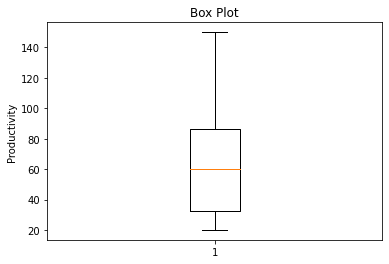
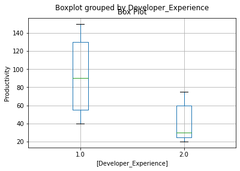
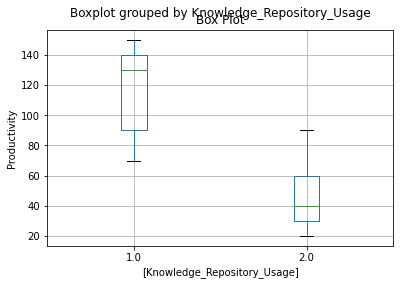

```python
import pandas as mypd
```


```python
# import the data
mydata = mypd.read_excel("Z:\Machine Learning\Descriptive Statistics\Productivity.xlsx")
```


```python
mydata
```


<div>
<style scoped>
    .dataframe tbody tr th:only-of-type {
        vertical-align: middle;
    }

    .dataframe tbody tr th {
        vertical-align: top;
    }

    .dataframe thead th {
        text-align: right;
    }
</style>
<table border="1" class="dataframe">
  <thead>
    <tr style="text-align: right;">
      <th></th>
      <th>SL No.</th>
      <th>Developer_Experience</th>
      <th>Code_Reuse</th>
      <th>Knowledge_Repository_Usage</th>
      <th>Productivity</th>
    </tr>
  </thead>
  <tbody>
    <tr>
      <th>0</th>
      <td>1.0</td>
      <td>1.0</td>
      <td>1.0</td>
      <td>1.0</td>
      <td>140.0</td>
    </tr>
    <tr>
      <th>1</th>
      <td>2.0</td>
      <td>2.0</td>
      <td>2.0</td>
      <td>2.0</td>
      <td>20.0</td>
    </tr>
    <tr>
      <th>2</th>
      <td>3.0</td>
      <td>2.0</td>
      <td>1.0</td>
      <td>2.0</td>
      <td>30.0</td>
    </tr>
    <tr>
      <th>3</th>
      <td>4.0</td>
      <td>2.0</td>
      <td>1.0</td>
      <td>2.0</td>
      <td>30.0</td>
    </tr>
    <tr>
      <th>4</th>
      <td>5.0</td>
      <td>1.0</td>
      <td>1.0</td>
      <td>1.0</td>
      <td>130.0</td>
    </tr>
    <tr>
      <th>5</th>
      <td>6.0</td>
      <td>2.0</td>
      <td>1.0</td>
      <td>2.0</td>
      <td>60.0</td>
    </tr>
    <tr>
      <th>6</th>
      <td>7.0</td>
      <td>2.0</td>
      <td>2.0</td>
      <td>2.0</td>
      <td>20.0</td>
    </tr>
    <tr>
      <th>7</th>
      <td>8.0</td>
      <td>2.0</td>
      <td>2.0</td>
      <td>2.0</td>
      <td>60.0</td>
    </tr>
    <tr>
      <th>8</th>
      <td>9.0</td>
      <td>2.0</td>
      <td>1.0</td>
      <td>2.0</td>
      <td>60.0</td>
    </tr>
    <tr>
      <th>9</th>
      <td>10.0</td>
      <td>1.0</td>
      <td>1.0</td>
      <td>2.0</td>
      <td>90.0</td>
    </tr>
    <tr>
      <th>10</th>
      <td>11.0</td>
      <td>2.0</td>
      <td>2.0</td>
      <td>2.0</td>
      <td>30.0</td>
    </tr>
    <tr>
      <th>11</th>
      <td>12.0</td>
      <td>2.0</td>
      <td>2.0</td>
      <td>2.0</td>
      <td>40.0</td>
    </tr>
    <tr>
      <th>12</th>
      <td>13.0</td>
      <td>1.0</td>
      <td>2.0</td>
      <td>1.0</td>
      <td>90.0</td>
    </tr>
    <tr>
      <th>13</th>
      <td>14.0</td>
      <td>1.0</td>
      <td>2.0</td>
      <td>2.0</td>
      <td>50.0</td>
    </tr>
    <tr>
      <th>14</th>
      <td>15.0</td>
      <td>1.0</td>
      <td>1.0</td>
      <td>2.0</td>
      <td>50.0</td>
    </tr>
    <tr>
      <th>15</th>
      <td>16.0</td>
      <td>2.0</td>
      <td>2.0</td>
      <td>2.0</td>
      <td>30.0</td>
    </tr>
    <tr>
      <th>16</th>
      <td>17.0</td>
      <td>1.0</td>
      <td>1.0</td>
      <td>1.0</td>
      <td>90.0</td>
    </tr>
    <tr>
      <th>17</th>
      <td>18.0</td>
      <td>1.0</td>
      <td>1.0</td>
      <td>2.0</td>
      <td>40.0</td>
    </tr>
    <tr>
      <th>18</th>
      <td>19.0</td>
      <td>1.0</td>
      <td>1.0</td>
      <td>1.0</td>
      <td>140.0</td>
    </tr>
    <tr>
      <th>19</th>
      <td>20.0</td>
      <td>2.0</td>
      <td>2.0</td>
      <td>2.0</td>
      <td>60.0</td>
    </tr>
    <tr>
      <th>20</th>
      <td>21.0</td>
      <td>1.0</td>
      <td>2.0</td>
      <td>2.0</td>
      <td>60.0</td>
    </tr>
    <tr>
      <th>21</th>
      <td>22.0</td>
      <td>1.0</td>
      <td>2.0</td>
      <td>1.0</td>
      <td>70.0</td>
    </tr>
    <tr>
      <th>22</th>
      <td>23.0</td>
      <td>2.0</td>
      <td>2.0</td>
      <td>2.0</td>
      <td>20.0</td>
    </tr>
    <tr>
      <th>23</th>
      <td>24.0</td>
      <td>1.0</td>
      <td>1.0</td>
      <td>1.0</td>
      <td>150.0</td>
    </tr>
    <tr>
      <th>24</th>
      <td>25.0</td>
      <td>2.0</td>
      <td>1.0</td>
      <td>2.0</td>
      <td>60.0</td>
    </tr>
    <tr>
      <th>25</th>
      <td>26.0</td>
      <td>1.0</td>
      <td>1.0</td>
      <td>1.0</td>
      <td>130.0</td>
    </tr>
    <tr>
      <th>26</th>
      <td>27.0</td>
      <td>2.0</td>
      <td>1.0</td>
      <td>1.0</td>
      <td>75.0</td>
    </tr>
    <tr>
      <th>27</th>
      <td>28.0</td>
      <td>2.0</td>
      <td>2.0</td>
      <td>2.0</td>
      <td>20.0</td>
    </tr>
    <tr>
      <th>28</th>
      <td>29.0</td>
      <td>1.0</td>
      <td>1.0</td>
      <td>2.0</td>
      <td>40.0</td>
    </tr>
    <tr>
      <th>29</th>
      <td>30.0</td>
      <td>1.0</td>
      <td>1.0</td>
      <td>2.0</td>
      <td>60.0</td>
    </tr>
  </tbody>
</table>
</div>


```python
mydata.info()

```

    <class 'pandas.core.frame.DataFrame'>
    RangeIndex: 30 entries, 0 to 29
    Data columns (total 5 columns):
     #   Column                      Non-Null Count  Dtype  
    ---  ------                      --------------  -----  
     0   SL No.                      30 non-null     float64
     1   Developer_Experience        30 non-null     float64
     2   Code_Reuse                  30 non-null     float64
     3   Knowledge_Repository_Usage  30 non-null     float64
     4   Productivity                30 non-null     float64
    dtypes: float64(5)
    memory usage: 1.3 KB
    


```python
mydata.head(3)

```


<div>
<style scoped>
    .dataframe tbody tr th:only-of-type {
        vertical-align: middle;
    }

    .dataframe tbody tr th {
        vertical-align: top;
    }

    .dataframe thead th {
        text-align: right;
    }
</style>
<table border="1" class="dataframe">
  <thead>
    <tr style="text-align: right;">
      <th></th>
      <th>SL No.</th>
      <th>Developer_Experience</th>
      <th>Code_Reuse</th>
      <th>Knowledge_Repository_Usage</th>
      <th>Productivity</th>
    </tr>
  </thead>
  <tbody>
    <tr>
      <th>0</th>
      <td>1.0</td>
      <td>1.0</td>
      <td>1.0</td>
      <td>1.0</td>
      <td>140.0</td>
    </tr>
    <tr>
      <th>1</th>
      <td>2.0</td>
      <td>2.0</td>
      <td>2.0</td>
      <td>2.0</td>
      <td>20.0</td>
    </tr>
    <tr>
      <th>2</th>
      <td>3.0</td>
      <td>2.0</td>
      <td>1.0</td>
      <td>2.0</td>
      <td>30.0</td>
    </tr>
  </tbody>
</table>
</div>


```python
prod=mydata.Productivity
prod.head()
```


    0    140.0
    1     20.0
    2     30.0
    3     30.0
    4    130.0
    Name: Productivity, dtype: float64


```python
prod.mean()
```


    64.83333333333333


```python
round(prod.mean(),3)
```


    64.833


```python
prod.median()
```


    60.0


```python
prod.mode()
```


    0    60.0
    dtype: float64


```python
round(prod.std(),3)
```


    39.139


```python
round(prod.var(),3)
```


    1531.868


```python
# complete descriptive stats
prod.describe()
```


    count     30.000000
    mean      64.833333
    std       39.139083
    min       20.000000
    25%       32.500000
    50%       60.000000
    75%       86.250000
    max      150.000000
    Name: Productivity, dtype: float64


```python
mydata.describe()

```


<div>
<style scoped>
    .dataframe tbody tr th:only-of-type {
        vertical-align: middle;
    }

    .dataframe tbody tr th {
        vertical-align: top;
    }

    .dataframe thead th {
        text-align: right;
    }
</style>
<table border="1" class="dataframe">
  <thead>
    <tr style="text-align: right;">
      <th></th>
      <th>SL No.</th>
      <th>Developer_Experience</th>
      <th>Code_Reuse</th>
      <th>Knowledge_Repository_Usage</th>
      <th>Productivity</th>
    </tr>
  </thead>
  <tbody>
    <tr>
      <th>count</th>
      <td>30.000000</td>
      <td>30.000000</td>
      <td>30.000000</td>
      <td>30.000000</td>
      <td>30.000000</td>
    </tr>
    <tr>
      <th>mean</th>
      <td>15.500000</td>
      <td>1.500000</td>
      <td>1.433333</td>
      <td>1.700000</td>
      <td>64.833333</td>
    </tr>
    <tr>
      <th>std</th>
      <td>8.803408</td>
      <td>0.508548</td>
      <td>0.504007</td>
      <td>0.466092</td>
      <td>39.139083</td>
    </tr>
    <tr>
      <th>min</th>
      <td>1.000000</td>
      <td>1.000000</td>
      <td>1.000000</td>
      <td>1.000000</td>
      <td>20.000000</td>
    </tr>
    <tr>
      <th>25%</th>
      <td>8.250000</td>
      <td>1.000000</td>
      <td>1.000000</td>
      <td>1.000000</td>
      <td>32.500000</td>
    </tr>
    <tr>
      <th>50%</th>
      <td>15.500000</td>
      <td>1.500000</td>
      <td>1.000000</td>
      <td>2.000000</td>
      <td>60.000000</td>
    </tr>
    <tr>
      <th>75%</th>
      <td>22.750000</td>
      <td>2.000000</td>
      <td>2.000000</td>
      <td>2.000000</td>
      <td>86.250000</td>
    </tr>
    <tr>
      <th>max</th>
      <td>30.000000</td>
      <td>2.000000</td>
      <td>2.000000</td>
      <td>2.000000</td>
      <td>150.000000</td>
    </tr>
  </tbody>
</table>
</div>


```python
# export the data
mydata.describe().to_csv("Z:\Machine Learning\Descriptive Statistics\Prod_desc.csv")
```


```python
# plot the graph
# import  package
import matplotlib.pyplot as myplot
```


```python
# plot histogram
myplot.hist(prod)
myplot.title("Histogram")
myplot.xlabel("Productivity")
myplot.ylabel("Frequency")
myplot.show()
```


    

    


```python
# plot boxplot
myplot.boxplot(prod)
myplot.title("Box Plot")
myplot.ylabel("Productivity")
myplot.show()
```


    

    


```python
# check whether the avg prod varies with developer exp using grouping
mydata.Productivity.groupby(mydata.Developer_Experience).describe()
```


<div>
<style scoped>
    .dataframe tbody tr th:only-of-type {
        vertical-align: middle;
    }

    .dataframe tbody tr th {
        vertical-align: top;
    }

    .dataframe thead th {
        text-align: right;
    }
</style>
<table border="1" class="dataframe">
  <thead>
    <tr style="text-align: right;">
      <th></th>
      <th>count</th>
      <th>mean</th>
      <th>std</th>
      <th>min</th>
      <th>25%</th>
      <th>50%</th>
      <th>75%</th>
      <th>max</th>
    </tr>
    <tr>
      <th>Developer_Experience</th>
      <th></th>
      <th></th>
      <th></th>
      <th></th>
      <th></th>
      <th></th>
      <th></th>
      <th></th>
    </tr>
  </thead>
  <tbody>
    <tr>
      <th>1.0</th>
      <td>15.0</td>
      <td>88.666667</td>
      <td>39.797104</td>
      <td>40.0</td>
      <td>55.0</td>
      <td>90.0</td>
      <td>130.0</td>
      <td>150.0</td>
    </tr>
    <tr>
      <th>2.0</th>
      <td>15.0</td>
      <td>41.000000</td>
      <td>19.291005</td>
      <td>20.0</td>
      <td>25.0</td>
      <td>30.0</td>
      <td>60.0</td>
      <td>75.0</td>
    </tr>
  </tbody>
</table>
</div>


```python
mydata.boxplot(column='Productivity',by=['Developer_Experience'])
myplot.title("Box Plot")
myplot.ylabel("Productivity")
myplot.show()
```


    

    


```python
# check whether the avg prod varies with code reuse
mydata.boxplot(column='Productivity',by=['Code_Reuse'])
myplot.title("Box Plot")
myplot.ylabel("Productivity")
myplot.show()
```


    

    


```python
# check whether the avg prod varies with know rep usage
mydata.boxplot(column='Productivity',by=['Knowledge_Repository_Usage'])
myplot.title("Box Plot")
myplot.ylabel("Productivity")
myplot.show()
```


    

    


```python
# compote the aggregate avg of prod with dev exp and cod reuse
mydata.boxplot(column='Productivity',by=['Developer_Experience','Code_Reuse'])
myplot.title("Box Plot")
myplot.ylabel("Productivity")
myplot.show()
```


    

    


```python
mydata.boxplot(column='Productivity',by=['Developer_Experience','Knowledge_Repository_Usage'])
myplot.title("Box Plot")
myplot.ylabel("Productivity")
myplot.show()
```


    

    


```python
mydata.boxplot(column='Productivity',by=['Developer_Experience','Code_Reuse','Knowledge_Repository_Usage'])
myplot.title("Box Plot")
myplot.ylabel("Productivity")
myplot.show()
```


    

    


```python
mydata.Productivity.groupby([mydata.Developer_Experience,mydata.Code_Reuse,mydata.Knowledge_Repository_Usage]).describe()
```


<div>
<style scoped>
    .dataframe tbody tr th:only-of-type {
        vertical-align: middle;
    }

    .dataframe tbody tr th {
        vertical-align: top;
    }

    .dataframe thead th {
        text-align: right;
    }
</style>
<table border="1" class="dataframe">
  <thead>
    <tr style="text-align: right;">
      <th></th>
      <th></th>
      <th></th>
      <th>count</th>
      <th>mean</th>
      <th>std</th>
      <th>min</th>
      <th>25%</th>
      <th>50%</th>
      <th>75%</th>
      <th>max</th>
    </tr>
    <tr>
      <th>Developer_Experience</th>
      <th>Code_Reuse</th>
      <th>Knowledge_Repository_Usage</th>
      <th></th>
      <th></th>
      <th></th>
      <th></th>
      <th></th>
      <th></th>
      <th></th>
      <th></th>
    </tr>
  </thead>
  <tbody>
    <tr>
      <th rowspan="4" valign="top">1.0</th>
      <th rowspan="2" valign="top">1.0</th>
      <th>1.0</th>
      <td>6.0</td>
      <td>130.000000</td>
      <td>20.976177</td>
      <td>90.0</td>
      <td>130.0</td>
      <td>135.0</td>
      <td>140.0</td>
      <td>150.0</td>
    </tr>
    <tr>
      <th>2.0</th>
      <td>5.0</td>
      <td>56.000000</td>
      <td>20.736441</td>
      <td>40.0</td>
      <td>40.0</td>
      <td>50.0</td>
      <td>60.0</td>
      <td>90.0</td>
    </tr>
    <tr>
      <th rowspan="2" valign="top">2.0</th>
      <th>1.0</th>
      <td>2.0</td>
      <td>80.000000</td>
      <td>14.142136</td>
      <td>70.0</td>
      <td>75.0</td>
      <td>80.0</td>
      <td>85.0</td>
      <td>90.0</td>
    </tr>
    <tr>
      <th>2.0</th>
      <td>2.0</td>
      <td>55.000000</td>
      <td>7.071068</td>
      <td>50.0</td>
      <td>52.5</td>
      <td>55.0</td>
      <td>57.5</td>
      <td>60.0</td>
    </tr>
    <tr>
      <th rowspan="3" valign="top">2.0</th>
      <th rowspan="2" valign="top">1.0</th>
      <th>1.0</th>
      <td>1.0</td>
      <td>75.000000</td>
      <td>NaN</td>
      <td>75.0</td>
      <td>75.0</td>
      <td>75.0</td>
      <td>75.0</td>
      <td>75.0</td>
    </tr>
    <tr>
      <th>2.0</th>
      <td>5.0</td>
      <td>48.000000</td>
      <td>16.431677</td>
      <td>30.0</td>
      <td>30.0</td>
      <td>60.0</td>
      <td>60.0</td>
      <td>60.0</td>
    </tr>
    <tr>
      <th>2.0</th>
      <th>2.0</th>
      <td>9.0</td>
      <td>33.333333</td>
      <td>16.583124</td>
      <td>20.0</td>
      <td>20.0</td>
      <td>30.0</td>
      <td>40.0</td>
      <td>60.0</td>
    </tr>
  </tbody>
</table>
</div>


```python

```
