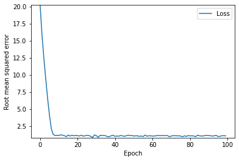

```python
import pandas as pd
import tensorflow as tf
from matplotlib import pyplot as plt
```


```python
#@title define the functions that build and train a model
def build_model(my_learning_rate):
    """Create and compile a simple linear regression model."""
    # tf.keras simple models are sequential,a seq. model contains one or more layers
    model = tf.keras.models.Sequential()
    
    #describe the topography of model
    model.add(tf.keras.layers.Dense(units=1,
                                    input_shape=(1,)))
    
    # compile the model topography 
    model.compile(optimizer=tf.keras.optimizers.RMSprop(learning_rate=my_learning_rate),
                  loss="mean_squared_error",
                  metrics=[tf.keras.metrics.RootMeanSquaredError()])
    return model

def train_model(model, feature, label, epochs, batch_size):
    """Train the model by feeding it data"""
    # feed the feature and label values to model
    history = model.fit(x=feature,
                        y=label,
                        batch_size=batch_size,
                        epochs=epochs)
    
    # gather the trained model's weight and bias
    trained_weight = model.get_weights()[0]
    trained_bias = model.get_weights()[1]
    
    # the list of epochs is stored seperately from the rest of history
    epochs = history.epoch
    
    # gather the history (a snapshot) of wach epoch
    hist = pd.DataFrame(history.history)
    
    # gather the model's root mean squared error at each epoch.
    rmse = hist["root_mean_squared_error"]
    
    return trained_weight,trained_bias,epochs,rmse

print("Defined create_model and train_model")
```

    Defined create_model and train_model
    


```python
# @title defining the plotting funcions
def plot_the_model(trained_weight,trained_bias,feature,label):
    """Plot the trained model against the training feature and label."""
    
    #Label the axes
    plt.xlabel("feature")
    plt.ylabel("label")
    
    #Plot the feature values vs label values
    plt.scatter(feature,label)
    
    # creating red line representing the model and it starts at 
    # coordinates (x0,y0) and ends at (x1,y1)
    x0 = 0
    y0 = trained_bias
    x1 = feature[-1]
    y1 = trained_bias + (trained_weight * x1)
    plt.plot([x0, x1], [y0, y1], c='r')
    
    # render the scatter plot and the red line
    plt.show()
    
def plot_the_loss_curve(epochs,rmse):
    """Plot the loss curve, which shows lloss vs epoch"""
    plt.figure()
    plt.xlabel("Epoch")
    plt.ylabel("Root mean squared error")
    
    plt.plot(epochs, rmse, label="Loss")
    plt.legend()
    plt.ylim([rmse.min()*0.97,rmse.max()])
    plt.show()
    
print("Defined the plot_the_model and plot_the_loss_curve functions. ")
```

    Defined the plot_the_model and plot_the_loss_curve functions. 
    


```python
my_feature = ([1.0, 2.0,  3.0,  4.0,  5.0,  6.0,  7.0,  8.0,  9.0, 10.0, 11.0, 12.0])
my_label   = ([5.0, 8.8,  9.6, 14.2, 18.8, 19.5, 21.4, 26.8, 28.9, 32.0, 33.8, 38.2])
```


```python
learning_rate=0.05
epochs=100
my_batch_size = 1

my_model = build_model(learning_rate)
trained_weight, trained_bias, epochs, rmse = train_model(my_model, my_feature, 
                                                         my_label, epochs,
                                                         my_batch_size)
plot_the_model(trained_weight,trained_bias,my_feature,my_label)
plot_the_loss_curve(epochs,rmse)
```

    Epoch 1/100
    12/12 [==============================] - 0s 1ms/step - loss: 409.4716 - root_mean_squared_error: 20.2354
    Epoch 2/100
    12/12 [==============================] - 0s 2ms/step - loss: 250.9711 - root_mean_squared_error: 15.8421
    Epoch 3/100
    12/12 [==============================] - 0s 2ms/step - loss: 155.3427 - root_mean_squared_error: 12.4637
    Epoch 4/100
    12/12 [==============================] - 0s 2ms/step - loss: 88.8405 - root_mean_squared_error: 9.4255
    Epoch 5/100
    12/12 [==============================] - 0s 2ms/step - loss: 42.9125 - root_mean_squared_error: 6.5508
    Epoch 6/100
    12/12 [==============================] - 0s 1ms/step - loss: 16.4129 - root_mean_squared_error: 4.0513
    Epoch 7/100
    12/12 [==============================] - 0s 1ms/step - loss: 4.3926 - root_mean_squared_error: 2.0958
    Epoch 8/100
    12/12 [==============================] - 0s 1ms/step - loss: 1.6028 - root_mean_squared_error: 1.2660
    Epoch 9/100
    12/12 [==============================] - 0s 1ms/step - loss: 1.2152 - root_mean_squared_error: 1.1024
    Epoch 10/100
    12/12 [==============================] - 0s 1ms/step - loss: 1.3029 - root_mean_squared_error: 1.1414
    Epoch 11/100
    12/12 [==============================] - 0s 1ms/step - loss: 1.2206 - root_mean_squared_error: 1.1048
    Epoch 12/100
    12/12 [==============================] - 0s 1ms/step - loss: 1.4873 - root_mean_squared_error: 1.2196
    Epoch 13/100
    12/12 [==============================] - 0s 1ms/step - loss: 1.3179 - root_mean_squared_error: 1.1480
    Epoch 14/100
    12/12 [==============================] - 0s 1ms/step - loss: 1.1655 - root_mean_squared_error: 1.0796
    Epoch 15/100
    12/12 [==============================] - 0s 2ms/step - loss: 0.8977 - root_mean_squared_error: 0.9475
    Epoch 16/100
    12/12 [==============================] - 0s 1ms/step - loss: 1.4072 - root_mean_squared_error: 1.1862
    Epoch 17/100
    12/12 [==============================] - 0s 1ms/step - loss: 1.0682 - root_mean_squared_error: 1.0335
    Epoch 18/100
    12/12 [==============================] - 0s 2ms/step - loss: 1.3207 - root_mean_squared_error: 1.1492
    Epoch 19/100
    12/12 [==============================] - 0s 2ms/step - loss: 1.1497 - root_mean_squared_error: 1.0723
    Epoch 20/100
    12/12 [==============================] - 0s 1ms/step - loss: 1.2535 - root_mean_squared_error: 1.1196
    Epoch 21/100
    12/12 [==============================] - 0s 2ms/step - loss: 1.1822 - root_mean_squared_error: 1.0873
    Epoch 22/100
    12/12 [==============================] - 0s 2ms/step - loss: 1.0877 - root_mean_squared_error: 1.0430
    Epoch 23/100
    12/12 [==============================] - 0s 2ms/step - loss: 1.3189 - root_mean_squared_error: 1.1484
    Epoch 24/100
    12/12 [==============================] - 0s 1ms/step - loss: 1.0408 - root_mean_squared_error: 1.0202
    Epoch 25/100
    12/12 [==============================] - 0s 2ms/step - loss: 1.1502 - root_mean_squared_error: 1.0725
    Epoch 26/100
    12/12 [==============================] - 0s 2ms/step - loss: 1.2959 - root_mean_squared_error: 1.1384
    Epoch 27/100
    12/12 [==============================] - 0s 1ms/step - loss: 1.2119 - root_mean_squared_error: 1.1008
    Epoch 28/100
    12/12 [==============================] - 0s 1ms/step - loss: 0.9993 - root_mean_squared_error: 0.9996
    Epoch 29/100
    12/12 [==============================] - 0s 1ms/step - loss: 0.6634 - root_mean_squared_error: 0.8145
    Epoch 30/100
    12/12 [==============================] - 0s 1ms/step - loss: 1.4578 - root_mean_squared_error: 1.2074
    Epoch 31/100
    12/12 [==============================] - 0s 1ms/step - loss: 1.2074 - root_mean_squared_error: 1.0988
    Epoch 32/100
    12/12 [==============================] - 0s 2ms/step - loss: 0.7153 - root_mean_squared_error: 0.8458
    Epoch 33/100
    12/12 [==============================] - 0s 2ms/step - loss: 1.2969 - root_mean_squared_error: 1.1388
    Epoch 34/100
    12/12 [==============================] - 0s 2ms/step - loss: 1.2180 - root_mean_squared_error: 1.1036
    Epoch 35/100
    12/12 [==============================] - 0s 2ms/step - loss: 1.2410 - root_mean_squared_error: 1.1140
    Epoch 36/100
    12/12 [==============================] - 0s 2ms/step - loss: 1.1626 - root_mean_squared_error: 1.0783
    Epoch 37/100
    12/12 [==============================] - 0s 2ms/step - loss: 0.8717 - root_mean_squared_error: 0.9336
    Epoch 38/100
    12/12 [==============================] - 0s 1ms/step - loss: 0.9184 - root_mean_squared_error: 0.9584
    Epoch 39/100
    12/12 [==============================] - 0s 2ms/step - loss: 1.1826 - root_mean_squared_error: 1.0875
    Epoch 40/100
    12/12 [==============================] - 0s 2ms/step - loss: 1.3197 - root_mean_squared_error: 1.1488
    Epoch 41/100
    12/12 [==============================] - 0s 2ms/step - loss: 0.9716 - root_mean_squared_error: 0.9857
    Epoch 42/100
    12/12 [==============================] - 0s 1ms/step - loss: 1.0842 - root_mean_squared_error: 1.0413
    Epoch 43/100
    12/12 [==============================] - 0s 1ms/step - loss: 1.0146 - root_mean_squared_error: 1.0073
    Epoch 44/100
    12/12 [==============================] - 0s 2ms/step - loss: 1.2545 - root_mean_squared_error: 1.1200
    Epoch 45/100
    12/12 [==============================] - 0s 2ms/step - loss: 1.1032 - root_mean_squared_error: 1.0503
    Epoch 46/100
    12/12 [==============================] - 0s 2ms/step - loss: 0.9783 - root_mean_squared_error: 0.9891
    Epoch 47/100
    12/12 [==============================] - 0s 2ms/step - loss: 1.1843 - root_mean_squared_error: 1.0883
    Epoch 48/100
    12/12 [==============================] - 0s 2ms/step - loss: 1.3576 - root_mean_squared_error: 1.1652
    Epoch 49/100
    12/12 [==============================] - 0s 2ms/step - loss: 1.1931 - root_mean_squared_error: 1.0923
    Epoch 50/100
    12/12 [==============================] - 0s 1ms/step - loss: 1.2340 - root_mean_squared_error: 1.1109
    Epoch 51/100
    12/12 [==============================] - 0s 2ms/step - loss: 1.0708 - root_mean_squared_error: 1.0348
    Epoch 52/100
    12/12 [==============================] - 0s 2ms/step - loss: 1.1440 - root_mean_squared_error: 1.0696
    Epoch 53/100
    12/12 [==============================] - 0s 2ms/step - loss: 1.1334 - root_mean_squared_error: 1.0646
    Epoch 54/100
    12/12 [==============================] - 0s 2ms/step - loss: 0.9702 - root_mean_squared_error: 0.9850
    Epoch 55/100
    12/12 [==============================] - 0s 2ms/step - loss: 1.0769 - root_mean_squared_error: 1.0377
    Epoch 56/100
    12/12 [==============================] - 0s 2ms/step - loss: 0.9284 - root_mean_squared_error: 0.9636
    Epoch 57/100
    12/12 [==============================] - 0s 2ms/step - loss: 1.3937 - root_mean_squared_error: 1.1806
    Epoch 58/100
    12/12 [==============================] - 0s 1ms/step - loss: 1.0233 - root_mean_squared_error: 1.0116
    Epoch 59/100
    12/12 [==============================] - 0s 1ms/step - loss: 1.1609 - root_mean_squared_error: 1.0774
    Epoch 60/100
    12/12 [==============================] - 0s 1ms/step - loss: 1.1398 - root_mean_squared_error: 1.0676
    Epoch 61/100
    12/12 [==============================] - 0s 1ms/step - loss: 1.0442 - root_mean_squared_error: 1.0219
    Epoch 62/100
    12/12 [==============================] - 0s 2ms/step - loss: 1.0902 - root_mean_squared_error: 1.0441
    Epoch 63/100
    12/12 [==============================] - 0s 1ms/step - loss: 1.1659 - root_mean_squared_error: 1.0798
    Epoch 64/100
    12/12 [==============================] - 0s 2ms/step - loss: 1.2456 - root_mean_squared_error: 1.1160
    Epoch 65/100
    12/12 [==============================] - 0s 2ms/step - loss: 1.1745 - root_mean_squared_error: 1.0837
    Epoch 66/100
    12/12 [==============================] - 0s 1ms/step - loss: 1.2262 - root_mean_squared_error: 1.1074
    Epoch 67/100
    12/12 [==============================] - 0s 2ms/step - loss: 1.1985 - root_mean_squared_error: 1.0948
    Epoch 68/100
    12/12 [==============================] - 0s 1000us/step - loss: 1.2004 - root_mean_squared_error: 1.0956
    Epoch 69/100
    12/12 [==============================] - 0s 1ms/step - loss: 1.2145 - root_mean_squared_error: 1.1020
    Epoch 70/100
    12/12 [==============================] - 0s 1ms/step - loss: 0.8579 - root_mean_squared_error: 0.9262
    Epoch 71/100
    12/12 [==============================] - 0s 1ms/step - loss: 1.0860 - root_mean_squared_error: 1.0421
    Epoch 72/100
    12/12 [==============================] - 0s 1ms/step - loss: 1.1959 - root_mean_squared_error: 1.0936
    Epoch 73/100
    12/12 [==============================] - 0s 1ms/step - loss: 1.1832 - root_mean_squared_error: 1.0877
    Epoch 74/100
    12/12 [==============================] - 0s 1ms/step - loss: 1.1413 - root_mean_squared_error: 1.0683
    Epoch 75/100
    12/12 [==============================] - 0s 1ms/step - loss: 1.1415 - root_mean_squared_error: 1.0684
    Epoch 76/100
    12/12 [==============================] - 0s 1ms/step - loss: 1.0591 - root_mean_squared_error: 1.0291
    Epoch 77/100
    12/12 [==============================] - 0s 1ms/step - loss: 0.8551 - root_mean_squared_error: 0.9247
    Epoch 78/100
    12/12 [==============================] - 0s 1ms/step - loss: 1.1432 - root_mean_squared_error: 1.0692
    Epoch 79/100
    12/12 [==============================] - 0s 1ms/step - loss: 0.9601 - root_mean_squared_error: 0.9798
    Epoch 80/100
    12/12 [==============================] - 0s 1ms/step - loss: 1.2246 - root_mean_squared_error: 1.1066
    Epoch 81/100
    12/12 [==============================] - 0s 1ms/step - loss: 1.1096 - root_mean_squared_error: 1.0534
    Epoch 82/100
    12/12 [==============================] - 0s 1ms/step - loss: 1.1530 - root_mean_squared_error: 1.0738
    Epoch 83/100
    12/12 [==============================] - 0s 1ms/step - loss: 1.0859 - root_mean_squared_error: 1.0421
    Epoch 84/100
    12/12 [==============================] - 0s 1ms/step - loss: 0.8709 - root_mean_squared_error: 0.9332
    Epoch 85/100
    12/12 [==============================] - 0s 1ms/step - loss: 1.3772 - root_mean_squared_error: 1.1736
    Epoch 86/100
    12/12 [==============================] - 0s 1ms/step - loss: 1.1519 - root_mean_squared_error: 1.0732
    Epoch 87/100
    12/12 [==============================] - 0s 1ms/step - loss: 1.0742 - root_mean_squared_error: 1.0365
    Epoch 88/100
    12/12 [==============================] - 0s 1ms/step - loss: 1.0958 - root_mean_squared_error: 1.0468
    Epoch 89/100
    12/12 [==============================] - 0s 1ms/step - loss: 1.2202 - root_mean_squared_error: 1.1046
    Epoch 90/100
    12/12 [==============================] - 0s 1ms/step - loss: 1.2376 - root_mean_squared_error: 1.1125
    Epoch 91/100
    12/12 [==============================] - 0s 2ms/step - loss: 1.2123 - root_mean_squared_error: 1.1010
    Epoch 92/100
    12/12 [==============================] - 0s 1ms/step - loss: 1.1620 - root_mean_squared_error: 1.0780
    Epoch 93/100
    12/12 [==============================] - 0s 1ms/step - loss: 1.0426 - root_mean_squared_error: 1.0211
    Epoch 94/100
    12/12 [==============================] - 0s 1ms/step - loss: 1.1835 - root_mean_squared_error: 1.0879
    Epoch 95/100
    12/12 [==============================] - 0s 1ms/step - loss: 1.2555 - root_mean_squared_error: 1.1205
    Epoch 96/100
    12/12 [==============================] - 0s 1ms/step - loss: 0.9317 - root_mean_squared_error: 0.9652
    Epoch 97/100
    12/12 [==============================] - 0s 1ms/step - loss: 0.9955 - root_mean_squared_error: 0.9977
    Epoch 98/100
    12/12 [==============================] - 0s 1ms/step - loss: 1.1667 - root_mean_squared_error: 1.0801
    Epoch 99/100
    12/12 [==============================] - 0s 1ms/step - loss: 1.1903 - root_mean_squared_error: 1.0910
    Epoch 100/100
    12/12 [==============================] - 0s 1ms/step - loss: 1.1305 - root_mean_squared_error: 1.0632
    

    C:\Users\hp\anaconda3\lib\site-packages\numpy\core\_asarray.py:171: VisibleDeprecationWarning: Creating an ndarray from ragged nested sequences (which is a list-or-tuple of lists-or-tuples-or ndarrays with different lengths or shapes) is deprecated. If you meant to do this, you must specify 'dtype=object' when creating the ndarray.
      return array(a, dtype, copy=False, order=order, subok=True)
    


    

    


    

    


```python

```
