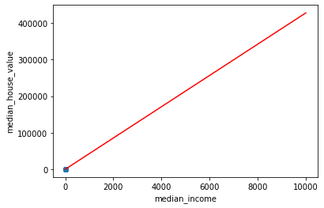
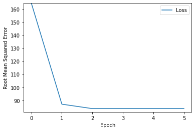

```python
# import relevent modules
import pandas as pd
import tensorflow as tf
from matplotlib import pyplot as plt

# The following lines adjust the granularity of reporting
pd.options.display.max_rows = 10
pd.options.display.float_format = "{:.1f}".format
```


```python
# import the dataset
training_df = pd.read_csv("Z:\Machine Learning\Google crash course on ML\Linear Regression with a Real Dataset\california_housing_train.csv")
training_df["median_house_value"] /= 1000
training_df.head()
```


<div>
<style scoped>
    .dataframe tbody tr th:only-of-type {
        vertical-align: middle;
    }

    .dataframe tbody tr th {
        vertical-align: top;
    }

    .dataframe thead th {
        text-align: right;
    }
</style>
<table border="1" class="dataframe">
  <thead>
    <tr style="text-align: right;">
      <th></th>
      <th>longitude</th>
      <th>latitude</th>
      <th>housing_median_age</th>
      <th>total_rooms</th>
      <th>total_bedrooms</th>
      <th>population</th>
      <th>households</th>
      <th>median_income</th>
      <th>median_house_value</th>
    </tr>
  </thead>
  <tbody>
    <tr>
      <th>0</th>
      <td>-114.3</td>
      <td>34.2</td>
      <td>15.0</td>
      <td>5612.0</td>
      <td>1283.0</td>
      <td>1015.0</td>
      <td>472.0</td>
      <td>1.5</td>
      <td>66.9</td>
    </tr>
    <tr>
      <th>1</th>
      <td>-114.5</td>
      <td>34.4</td>
      <td>19.0</td>
      <td>7650.0</td>
      <td>1901.0</td>
      <td>1129.0</td>
      <td>463.0</td>
      <td>1.8</td>
      <td>80.1</td>
    </tr>
    <tr>
      <th>2</th>
      <td>-114.6</td>
      <td>33.7</td>
      <td>17.0</td>
      <td>720.0</td>
      <td>174.0</td>
      <td>333.0</td>
      <td>117.0</td>
      <td>1.7</td>
      <td>85.7</td>
    </tr>
    <tr>
      <th>3</th>
      <td>-114.6</td>
      <td>33.6</td>
      <td>14.0</td>
      <td>1501.0</td>
      <td>337.0</td>
      <td>515.0</td>
      <td>226.0</td>
      <td>3.2</td>
      <td>73.4</td>
    </tr>
    <tr>
      <th>4</th>
      <td>-114.6</td>
      <td>33.6</td>
      <td>20.0</td>
      <td>1454.0</td>
      <td>326.0</td>
      <td>624.0</td>
      <td>262.0</td>
      <td>1.9</td>
      <td>65.5</td>
    </tr>
  </tbody>
</table>
</div>


```python
# To get statistics on the dataset
training_df.describe()
```


<div>
<style scoped>
    .dataframe tbody tr th:only-of-type {
        vertical-align: middle;
    }

    .dataframe tbody tr th {
        vertical-align: top;
    }

    .dataframe thead th {
        text-align: right;
    }
</style>
<table border="1" class="dataframe">
  <thead>
    <tr style="text-align: right;">
      <th></th>
      <th>longitude</th>
      <th>latitude</th>
      <th>housing_median_age</th>
      <th>total_rooms</th>
      <th>total_bedrooms</th>
      <th>population</th>
      <th>households</th>
      <th>median_income</th>
      <th>median_house_value</th>
    </tr>
  </thead>
  <tbody>
    <tr>
      <th>count</th>
      <td>17000.0</td>
      <td>17000.0</td>
      <td>17000.0</td>
      <td>17000.0</td>
      <td>17000.0</td>
      <td>17000.0</td>
      <td>17000.0</td>
      <td>17000.0</td>
      <td>17000.0</td>
    </tr>
    <tr>
      <th>mean</th>
      <td>-119.6</td>
      <td>35.6</td>
      <td>28.6</td>
      <td>2643.7</td>
      <td>539.4</td>
      <td>1429.6</td>
      <td>501.2</td>
      <td>3.9</td>
      <td>207.3</td>
    </tr>
    <tr>
      <th>std</th>
      <td>2.0</td>
      <td>2.1</td>
      <td>12.6</td>
      <td>2179.9</td>
      <td>421.5</td>
      <td>1147.9</td>
      <td>384.5</td>
      <td>1.9</td>
      <td>116.0</td>
    </tr>
    <tr>
      <th>min</th>
      <td>-124.3</td>
      <td>32.5</td>
      <td>1.0</td>
      <td>2.0</td>
      <td>1.0</td>
      <td>3.0</td>
      <td>1.0</td>
      <td>0.5</td>
      <td>15.0</td>
    </tr>
    <tr>
      <th>25%</th>
      <td>-121.8</td>
      <td>33.9</td>
      <td>18.0</td>
      <td>1462.0</td>
      <td>297.0</td>
      <td>790.0</td>
      <td>282.0</td>
      <td>2.6</td>
      <td>119.4</td>
    </tr>
    <tr>
      <th>50%</th>
      <td>-118.5</td>
      <td>34.2</td>
      <td>29.0</td>
      <td>2127.0</td>
      <td>434.0</td>
      <td>1167.0</td>
      <td>409.0</td>
      <td>3.5</td>
      <td>180.4</td>
    </tr>
    <tr>
      <th>75%</th>
      <td>-118.0</td>
      <td>37.7</td>
      <td>37.0</td>
      <td>3151.2</td>
      <td>648.2</td>
      <td>1721.0</td>
      <td>605.2</td>
      <td>4.8</td>
      <td>265.0</td>
    </tr>
    <tr>
      <th>max</th>
      <td>-114.3</td>
      <td>42.0</td>
      <td>52.0</td>
      <td>37937.0</td>
      <td>6445.0</td>
      <td>35682.0</td>
      <td>6082.0</td>
      <td>15.0</td>
      <td>500.0</td>
    </tr>
  </tbody>
</table>
</div>


```python
# Define the build and train model function
def build_model(my_learning_rate):
    # Create simple linear regression model (Sequential)
    model = tf.keras.models.Sequential()
    # Describe the topography of the model
    model.add(tf.keras.layers.Dense(units=1, input_shape=(1,)))
    # Compile the model topography
    model.compile(optimizer=tf.keras.optimizers.RMSprop(learning_rate=my_learning_rate),
                 loss="mean_squared_error",
                 metrics=[tf.keras.metrics.RootMeanSquaredError()])
    return model

def train_model(model, df, feature, label, epochs, batch_size):
    """Training the model by feeding the data"""
    # Feed the model the feature and the label
    history = model.fit(x=df[feature],
                        y=df[label],
                        batch_size=batch_size,
                        epochs=epochs)
    
    # Gather the trained model's weight and bias.
    trained_weight = model.get_weights()[0]
    trained_bias = model.get_weights()[1]
    
    # The list of epochs is stored separately the rest of history
    epochs = history.epoch
    
    # Isolate the error for each epoch
    hist = pd.DataFrame(history.history)
    
    # Take snapshot of the rmse at each epoch to take the progression of training
    rmse = hist["root_mean_squared_error"]
    
    return trained_weight, trained_bias, epochs, rmse

print("Defined build model and train model function")
```

    Defined build model and train model function
    


```python
def plot_the_model(trained_weight, trained_bias, feature, label):
    # Label the axes
    plt.xlabel(feature)
    plt.ylabel(label)
    
    # Create a scatter plot from random points of the dataset
    random_examples = training_df.sample(n=200)
    plt.scatter(random_examples[feature], random_examples[label])
    
    # Create the line representing the model
    x0 = 0
    y0 = trained_bias
    x1 = 10000
    y1 = trained_bias + (trained_weight*x1)
    plt.plot([x0, x1], [y0, y1], c='r')
    
    plt.show()
    
def plot_the_loss_curve(epochs, rmse):
    """Plot the loss vs epoch curve"""
    plt.figure()
    plt.xlabel("Epoch")
    plt.ylabel("Root Mean Squared Error")
    
    plt.plot(epochs, rmse, label="Loss")
    plt.legend()
    plt.ylim([rmse.min()*0.97, rmse.max()])
    plt.show()
    
print("Defined plot_the_model and plot_the_loss_curve functions")
```

    Defined plot_the_model and plot_the_loss_curve functions
    


```python
def predict_house_values(n, feature, label):
    """Predicts house value based on a feature"""
    batch = training_df[feature][10000:10000 + n]
    predicted_values = my_model.predict_on_batch(x=batch)
    
    print("feature   label          predicted")
    print(" value    value          value")
    print("          in thousand$   in thousand$")
    print("--------------------------------------")
    for i in range(n):
        print ("%5.0f %6.0f %15.0f" % (training_df[feature][10000 + i],
                                   training_df[label][10000 + i],
                                   predicted_values[i][0] ))      
        
        
```


```python
# To find the correlation among the features
training_df.corr()
```


<div>
<style scoped>
    .dataframe tbody tr th:only-of-type {
        vertical-align: middle;
    }

    .dataframe tbody tr th {
        vertical-align: top;
    }

    .dataframe thead th {
        text-align: right;
    }
</style>
<table border="1" class="dataframe">
  <thead>
    <tr style="text-align: right;">
      <th></th>
      <th>longitude</th>
      <th>latitude</th>
      <th>housing_median_age</th>
      <th>total_rooms</th>
      <th>total_bedrooms</th>
      <th>population</th>
      <th>households</th>
      <th>median_income</th>
      <th>median_house_value</th>
    </tr>
  </thead>
  <tbody>
    <tr>
      <th>longitude</th>
      <td>1.0</td>
      <td>-0.9</td>
      <td>-0.1</td>
      <td>0.0</td>
      <td>0.1</td>
      <td>0.1</td>
      <td>0.1</td>
      <td>-0.0</td>
      <td>-0.0</td>
    </tr>
    <tr>
      <th>latitude</th>
      <td>-0.9</td>
      <td>1.0</td>
      <td>0.0</td>
      <td>-0.0</td>
      <td>-0.1</td>
      <td>-0.1</td>
      <td>-0.1</td>
      <td>-0.1</td>
      <td>-0.1</td>
    </tr>
    <tr>
      <th>housing_median_age</th>
      <td>-0.1</td>
      <td>0.0</td>
      <td>1.0</td>
      <td>-0.4</td>
      <td>-0.3</td>
      <td>-0.3</td>
      <td>-0.3</td>
      <td>-0.1</td>
      <td>0.1</td>
    </tr>
    <tr>
      <th>total_rooms</th>
      <td>0.0</td>
      <td>-0.0</td>
      <td>-0.4</td>
      <td>1.0</td>
      <td>0.9</td>
      <td>0.9</td>
      <td>0.9</td>
      <td>0.2</td>
      <td>0.1</td>
    </tr>
    <tr>
      <th>total_bedrooms</th>
      <td>0.1</td>
      <td>-0.1</td>
      <td>-0.3</td>
      <td>0.9</td>
      <td>1.0</td>
      <td>0.9</td>
      <td>1.0</td>
      <td>-0.0</td>
      <td>0.0</td>
    </tr>
    <tr>
      <th>population</th>
      <td>0.1</td>
      <td>-0.1</td>
      <td>-0.3</td>
      <td>0.9</td>
      <td>0.9</td>
      <td>1.0</td>
      <td>0.9</td>
      <td>-0.0</td>
      <td>-0.0</td>
    </tr>
    <tr>
      <th>households</th>
      <td>0.1</td>
      <td>-0.1</td>
      <td>-0.3</td>
      <td>0.9</td>
      <td>1.0</td>
      <td>0.9</td>
      <td>1.0</td>
      <td>0.0</td>
      <td>0.1</td>
    </tr>
    <tr>
      <th>median_income</th>
      <td>-0.0</td>
      <td>-0.1</td>
      <td>-0.1</td>
      <td>0.2</td>
      <td>-0.0</td>
      <td>-0.0</td>
      <td>0.0</td>
      <td>1.0</td>
      <td>0.7</td>
    </tr>
    <tr>
      <th>median_house_value</th>
      <td>-0.0</td>
      <td>-0.1</td>
      <td>0.1</td>
      <td>0.1</td>
      <td>0.0</td>
      <td>-0.0</td>
      <td>0.1</td>
      <td>0.7</td>
      <td>1.0</td>
    </tr>
  </tbody>
</table>
</div>


```python
# Calling the functions
# The below variables are hyperparameteres
learning_rate = 0.01
epochs = 6
batch_size = 5

# Specify the feature and label
my_feature = "median_income" # total no. of rooms on a specific city block
my_label = "median_house_value" # the median value of a house on a specific city block
# So we are going to make a model that predicts house value based solely on total rooms

# Discarding any pre existing version of the model
my_model = None 

# Function calling
my_model = build_model(learning_rate)
weight, bias, epochs, rmse = train_model(my_model, training_df, my_feature,
                                        my_label, epochs, batch_size)

print("\nThe learned weight for our model is %.4f"%weight)
print("\nThe learned bias for our model is %.4f"%bias)

plot_the_model(weight, bias, my_feature, my_label)
plot_the_loss_curve(epochs,rmse)

predict_house_values(10,my_feature, my_label)
```

    Epoch 1/6
    3400/3400 [==============================] - 14s 4ms/step - loss: 27038.8086 - root_mean_squared_error: 164.4348
    Epoch 2/6
    3400/3400 [==============================] - 15s 5ms/step - loss: 7596.2217 - root_mean_squared_error: 87.1563
    Epoch 3/6
    3400/3400 [==============================] - 12s 4ms/step - loss: 7014.9697 - root_mean_squared_error: 83.7554
    Epoch 4/6
    3400/3400 [==============================] - 19s 6ms/step - loss: 7015.0273 - root_mean_squared_error: 83.7558
    Epoch 5/6
    3400/3400 [==============================] - 14s 4ms/step - loss: 7015.6816 - root_mean_squared_error: 83.7597
    Epoch 6/6
    3400/3400 [==============================] - 19s 5ms/step - loss: 7015.5532 - root_mean_squared_error: 83.7589
    
    The learned weight for our model is 42.7585
    
    The learned bias for our model is 41.1521
    

    C:\Users\hp\anaconda3\lib\site-packages\numpy\core\_asarray.py:171: VisibleDeprecationWarning: Creating an ndarray from ragged nested sequences (which is a list-or-tuple of lists-or-tuples-or ndarrays with different lengths or shapes) is deprecated. If you meant to do this, you must specify 'dtype=object' when creating the ndarray.
      return array(a, dtype, copy=False, order=order, subok=True)
    


    

    


    

    


    feature   label          predicted
     value    value          value
              in thousand$   in thousand$
    --------------------------------------
        2     53             133
        4     92             212
        3     69             153
        2     62             131
        3     80             153
        2    295             147
       10    500             459
        5    342             260
        2    118             146
        4    128             221
    
